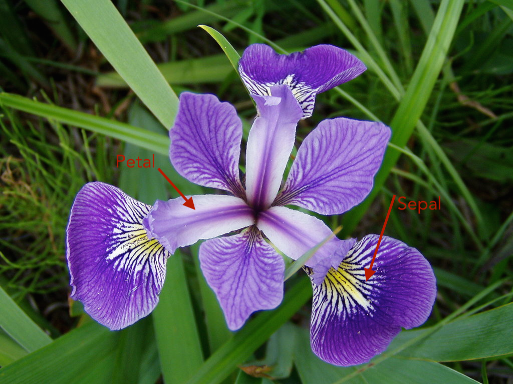
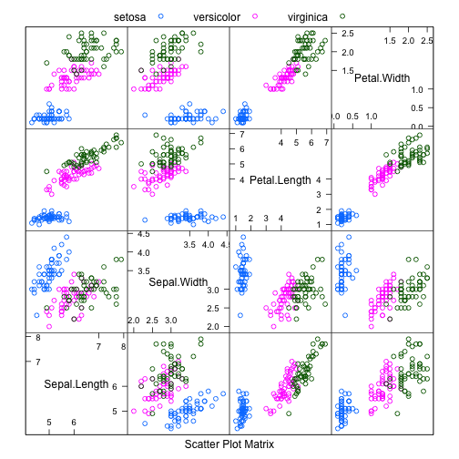
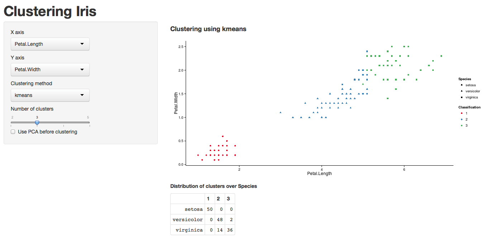

Clustering Iris
========================================================
author: Gabriel Granåsen
date: December 21, 2014
***

Problem formulation
========================================================
I have an interest in statistical learning and have done some work using un-supervised learning. 
With this application I wanted to demostrate a couple of different things.

* How the two common clustering methods **Mclust** and **K-means** can cluster a dataset. 
* How results can differ by dimension reduction using principal components analysis
* How changing the number of clusters can change the outcome

Iris
========================================================
 

***
I used the famous Iris dataset, first used by the even more famous statistician *Sir Ronald Fisher*.

The data consists of 50 observations of Iris flowers from three different species:
*Setosa*, *Virginica* and *Versicolor* which **sepal** and **petal** heights and widths were measured.

Cluster analysis
========================================================
**Mclust** is a model based clustering algorithm created by *Chris Fraley* and *Adrian Raftery*.
It uses the EM-algorithm to fit a normal mixture model to fit the data
That is finding multivariate normal distributed cluster centroids and assigning each observation to one of them
The number of clusters and shapes of the centroids are determined by the bayesian information criteria.

**K-means** is a clustering method that starts by finding *k* cluster centers. The algorithm then assigns each observation to the nearest cluster center. New cluster centers are calculated as means of the observations in the cluster. Then the observation are again assigned to the nearest cluster center and the algorithm iterates until convergens.

The Application
========================================================
The result consists of a simple to use **Shiny** application with an inteface that let the user play around 
changing the clustering methods, number of clusters and the use of dimension reduction.

